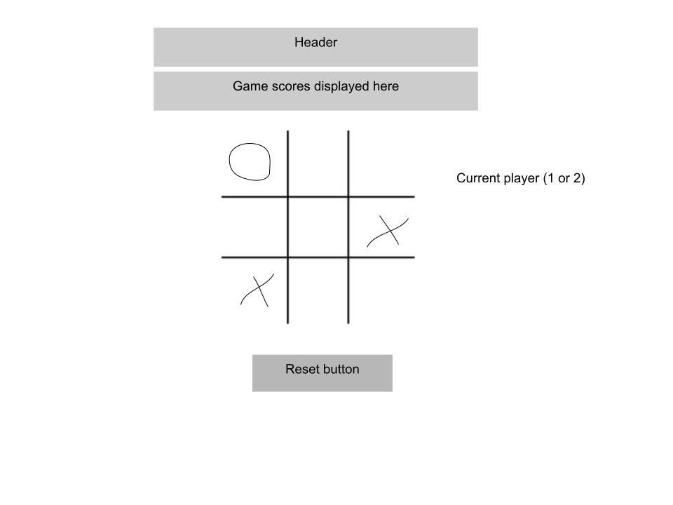

# Java(script) and Pythons
This is a (topical) version of tic-tac-toe, featuring java(beans) for JavaScript, and snakes for Python. :snake:  :coffee: Coffee beans represent crosses, and snakes represent noughts.

## [https://rainpatter.github.io/tictactoe/](#) to see my live project!

## About
- How to use my awesome project.
- Download instructions (if relevant):
$ git clone https://github.com/rainpatter/tictactoe.git
$ cd tictactoe
$ open index.html

## Planning & Problem Solving

- Basic wireframe

- Determine DOM variables (buttons, clickable elements, text to update)
- Determine win states and game variables (e.g. player, win/draw, score, round)
- Functions for: click handlers, switching players, checking win state, checking draw state, reinitialising game board
- Win state function would feed in current player and check game board against possible win states
- Draw state function would check not win and that all elements on board had been clicked

## Scripting and media
- Programming languages: HTML, CSS, JavaScript
- Images sourced from: https://openmoji.org/
- Audio sourced from: https://pixabay.com/ 

## Bugs to fix 
- Only works on PC screens - didn't work on mobile formatting!

## Lessons learnt
- Plan layout of website prior to/alongside app scripting - this was more difficult to implement later
- Think about screen layouts prior to starting

## Future features
- Animations for win
- Replace current player div with win state div (tried this but couldn't get it to work)
- Improve CSS formatting 
- Add in other game features i.e., AI opponent, try a tic-tac-toe variant
